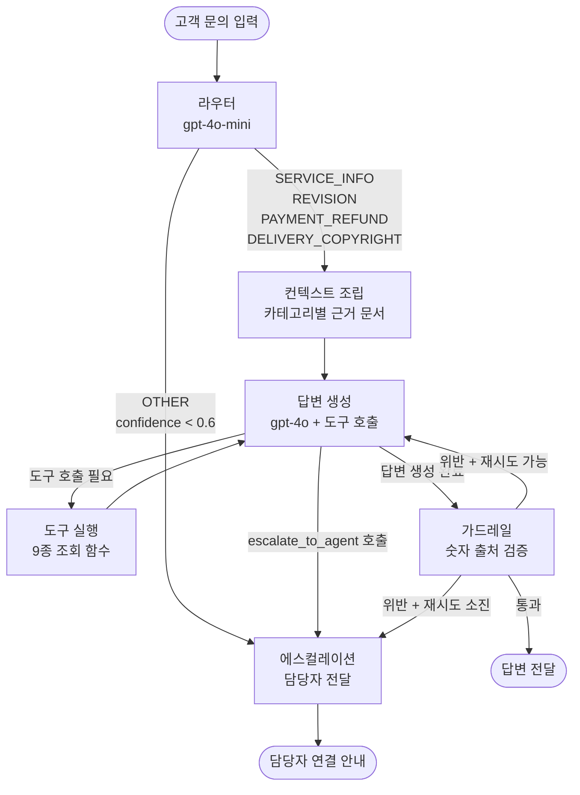

# 디자인코(DesignCo) 고객응대 라우팅 에이전트 — 프로젝트 리포트

## 1. 주제와 근거 문서

### 주제 선정

**온라인 로고·브랜딩 디자인 에이전시**의 고객응대 에이전트를 구축했습니다.

디자인 서비스는 주문→제작→수정→납품의 명확한 워크플로우가 있고, 각 단계마다 고객 문의가 달라지며(가격, 수정, 환불, 납품), 근거가 필요한 숫자(가격, 수정 횟수, 환불율)가 많아 가드레일 검증이 유의미한 도메인입니다.

### 근거 문서 (4종)

| 문서 | 파일명 | 주요 내용 |
|------|--------|----------|
| 서비스 가이드 | `docs/service_guide.md` | 패키지별 가격·시안수·수정횟수·작업일, 작업 프로세스, 수정 정책, 긴급 작업 |
| 환불 정책 | `docs/refund_policy.md` | 단계별 환불율, 환불 불가 항목, 절차, 결제 수단별 안내 |
| 납품·저작권 가이드 | `docs/delivery_copyright.md` | 파일 형식, 저작권 이전 조건, 원본 소스, 데이터 보관 |
| 이용약관 | `docs/terms_of_service.md` | 계약, 결제(착수금/잔금), 의무, 면책 |

실제 디자인 에이전시들의 이용약관을 참고하여 현실적인 합성 문서를 작성했습니다.

---

## 2. 카테고리 설계

### 카테고리 목록 (5개)

| 카테고리 | 설명 | 근거 |
|---------|------|------|
| **SERVICE_INFO** | 서비스 종류, 가격, 견적, 작업 기간, 패키지 비교 | 고객 문의의 대부분은 "얼마인가요", "뭐가 포함되나요"로 시작 |
| **REVISION** | 수정 횟수, 추가 수정 비용, 수정 범위, 피드백 기한 | 디자인 서비스 특성상 수정 관련 문의가 독립적 카테고리로 분리할 만큼 빈번 |
| **PAYMENT_REFUND** | 결제, 환불, 취소, 세금계산서 | 결제/환불은 별도 정책 문서가 있으며 처리 절차가 다름 |
| **DELIVERY_COPYRIGHT** | 납품 파일, 저작권 이전, 원본 소스, 상표 등록 | 디자인 도메인 고유의 카테고리 — 일반 쇼핑몰에는 없는 문의 유형 |
| **OTHER** | 위 어디에도 속하지 않는 문의 | 에스컬레이션 경로 확보 |

### 카테고리-문서 매핑표

| 카테고리 | 근거 문서 | 참조 섹션 |
|---------|----------|----------|
| SERVICE_INFO | service_guide.md | §1 회사소개, §2 서비스 종류/가격, §3 작업 프로세스, §5 작업 기간 |
| SERVICE_INFO | terms_of_service.md | §2 서비스 범위, §3 계약의 성립 |
| REVISION | service_guide.md | §4 수정 정책, §5 작업 기간 |
| PAYMENT_REFUND | refund_policy.md | §1~§6 전체 |
| PAYMENT_REFUND | terms_of_service.md | §4 결제, §8 취소 및 환불 |
| DELIVERY_COPYRIGHT | delivery_copyright.md | §1~§5 전체 |
| DELIVERY_COPYRIGHT | terms_of_service.md | §7 지식재산권 |
| OTHER | — | 근거 없음 → 에스컬레이션 |

카테고리를 나눈 근거:
- 문서의 물리적 구분(서비스 가이드 vs 환불 정책 vs 납품 가이드)이 자연스럽게 카테고리와 대응
- 실제 디자인 서비스 고객 문의 유형(서비스 문의 > 수정 문의 > 결제/환불 > 납품)을 반영
- 각 카테고리마다 조회해야 할 도구가 다름

---

## 3. 평가셋 설계

### 구성

- **총 18건**: 평가용 15건 (`use: "eval"`) + 프롬프트 예시용 3건 (`use: "prompt_example"`)
- 카테고리별 분포: SERVICE_INFO 4건, REVISION 4건, PAYMENT_REFUND 4건, DELIVERY_COPYRIGHT 4건, OTHER 1건 (+ 예시 3건)

### 각 문항의 구조

```json
{
  "id": 7,
  "question": "PRJ-2024-004 지금 취소하면 얼마나 돌려받을 수 있어요?",
  "expected_route": "PAYMENT_REFUND",
  "expected_tools": ["get_refund_info"],
  "must": ["50%", "181,500"],
  "forbid": ["70%", "100%", "전액"],
  "reference": "50% 환불 가능, 181,500원 환불",
  "use": "eval"
}
```

### 설계 기준

- **기대 도구**: 해당 문의에 정확한 답변을 위해 반드시 조회해야 하는 도구
- **필수 사실(must)**: 근거 문서/도구 결과에서 도출되는 핵심 수치나 사실
- **금지 표현(forbid)**: 문서를 읽지 않았을 때 나올 수 있는 그럴듯한 오답
  - 예: 환불 50%인데 "70%" 또는 "전액"이라고 답하는 것
  - 예: BI 스탠다드에 없는 "브랜드 가이드북"을 포함된다고 답하는 것
- **문서에 답이 없는 문의**: ID 12 ("AI로 하시나요, 사람이 하시나요?") → 에스컬레이션이 정답

### 채점기 검증

모범 답안(reference)으로 채점기 자체를 검증합니다. 모든 reference가 해당 must를 포함하고 forbid를 위반하지 않아야 평가가 시작됩니다.

---

## 4. 측정 결과

### 지표 정의

| 지표 | 산출 방식 | 의미 |
|------|----------|------|
| 라우팅 정확도 | 기대 카테고리 == 실제 카테고리 | 문의를 올바른 카테고리로 분류했는가 |
| 도구 호출 적절성 | 기대 도구 집합 == 실제 호출 도구 집합 | 필요한 근거를 조회했는가, 불필요한 조회는 없는가 |
| 답변 적절성 | must 전부 포함 + forbid 전부 미포함 | 정확한 사실을 전달하고 오답을 포함하지 않았는가 |

### 실패 원인 분류 체계

| 분류 | 설명 |
|------|------|
| 라우팅 오류 | 카테고리를 잘못 분류하여 엉뚱한 근거를 참조 |
| 도구 미호출 | 필요한 도구를 호출하지 않아 정보 부족 |
| 도구 과호출 | 불필요한 도구를 호출 (비효율) |
| 필수 사실 누락 | 근거에 있는 정보를 답변에 포함하지 않음 |
| 금지 표현 위반 | 근거에 없는 내용을 지어냄 (할루시네이션) |
| 가드레일 위반 | 출처 불명 숫자가 답변에 포함됨 |

### 개선 기록표

| 시도 | 변경 내용 | 라우팅 | 도구 호출 | 답변 적절성 |
|------|----------|--------|----------|-----------|
| v1 (초기) | 기본 구현 | 93.3% | 60.0% | 80.0% |
| v2 | 답변 프롬프트에 도구 호출 절차를 구체화 (서비스 문의→search_service 필수, 범위 밖→escalate_to_agent 필수) | 93.3% | 73.3% | 80.0% |
| v3 | 라우팅 설명에 "긴급 작업 비용→SERVICE_INFO" 명시, 평가셋 표현 유연화 (must 키워드 조정) | **100%** | 73.3% | 86.7% |
| v4 (최종) | 에스컬레이션 노드에서 escalate_to_agent 도구 실제 호출, 도구 호출 절차를 카테고리별로 세분화, 과잉 정보 방지 규칙 추가 | **100%** | **86.7%** | **93.3%** |

### v4 실패 사례 상세 분석 (2건)

| ID | 질문 | 실패 유형 | 원인 |
|----|------|----------|------|
| 2 | BI 스탠다드 포함 항목 | 도구 미호출 (get_service_detail) | 근거 문서에 충분한 정보가 있어 LLM이 도구 호출 없이 답변 |
| 9 | 로고 베이직 원본 소스? | 도구 미호출 + 필수 누락 | 근거 문서로만 답변하여 get_service_detail 미호출, "별도 구매" 표현 누락 |

두 건 모두 LLM이 컨텍스트 문서에서 충분한 정보를 발견하여 도구를 호출하지 않는 패턴입니다. 답변 자체는 사실상 정확하나, 도구 호출을 통한 근거 확보 원칙에 미달합니다.

### 개선 과정에서 해결된 문제들

| 시도 | 해결된 문제 |
|------|-----------|
| v3 | ID 11 라우팅 오류 (REVISION→SERVICE_INFO), ID 6 표현 불일치, ID 10 표현 불일치 |
| v4 | ID 12 에스컬레이션 도구 미호출, ID 4 과잉 정보 제공, ID 11 50% 할루시네이션, ID 13 도구 미호출 |

### macro F1 및 혼동행렬 (v4 최종)

**라우팅 분류 리포트** (`sklearn.metrics.classification_report`):

| 카테고리 | precision | recall | F1-score | support |
|---------|-----------|--------|----------|---------|
| DELIVERY_COPYRIGHT | 1.00 | 1.00 | 1.00 | 3 |
| OTHER | 1.00 | 1.00 | 1.00 | 1 |
| PAYMENT_REFUND | 1.00 | 1.00 | 1.00 | 4 |
| REVISION | 1.00 | 1.00 | 1.00 | 3 |
| SERVICE_INFO | 1.00 | 1.00 | 1.00 | 4 |
| **macro avg** | **1.00** | **1.00** | **1.00** | **15** |

**혼동행렬:**

| 실제 ↓ \ 예측 → | DELIVERY | OTHER | PAYMENT | REVISION | SERVICE |
|----------------|----------|-------|---------|----------|---------|
| DELIVERY_COPYRIGHT | **3** | 0 | 0 | 0 | 0 |
| OTHER | 0 | **1** | 0 | 0 | 0 |
| PAYMENT_REFUND | 0 | 0 | **4** | 0 | 0 |
| REVISION | 0 | 0 | 0 | **3** | 0 |
| SERVICE_INFO | 0 | 0 | 0 | 0 | **4** |

- 라우팅 오분류 0건: 전체 15건 모두 정확히 분류됨

---

## 5. 파이프라인 구조도

### 전체 아키텍처 (Mermaid)



### LangGraph 노드 및 상태(State) 흐름

```
AgentState:
  question      ─→ [route] ─→ route, confidence, action
                              ─→ [answer] ─→ context, tools_called, tool_results, answer, action
                                            ─→ [guard] ─→ guardrail_ok, guardrail_violations, action
                                                         ─→ [escalate] ─→ answer (에스컬레이션 메시지)
```

### 도구 목록 (9종)

| 도구 | 기능 | 사용 카테고리 |
|------|------|-------------|
| `search_service` | 서비스/패키지 검색 | SERVICE_INFO |
| `get_service_detail` | 서비스 상세 정보 | SERVICE_INFO, DELIVERY_COPYRIGHT |
| `get_project_status` | 프로젝트 진행 상태 | 전체 |
| `get_revision_info` | 수정 현황 및 추가 비용 | REVISION |
| `get_refund_info` | 환불 가능 여부/금액 | PAYMENT_REFUND |
| `get_payment_info` | 결제 현황 | PAYMENT_REFUND |
| `get_delivery_info` | 납품 상태/파일 정보 | DELIVERY_COPYRIGHT |
| `get_copyright_info` | 저작권 이전/소스 구매 | DELIVERY_COPYRIGHT |
| `escalate_to_agent` | 담당자 에스컬레이션 | OTHER |

---

## 6. 데모 설계

### 화면 구성

Streamlit 기반 채팅 인터페이스로 구현했습니다.

**좌측 사이드바:**
- 처리 가능한 문의 카테고리 안내
- 테스트용 프로젝트 ID 목록

**메인 영역:**
- 채팅 형식의 대화 인터페이스
- 각 답변마다 "상세 정보" 펼치기 제공

**상세 정보 (답변별 펼치기):**
- 라우트 및 확신도
- 가드레일 통과 여부
- 호출한 도구 목록
- 도구 조회 결과 원문
- 참조한 근거 문서 내용

### 데모 화면 캡처

**질문 입력 및 답변 화면:**

"로고 디자인 가격이 어떻게 되나요?" 문의에 대해 에이전트가 `search_service` 도구를 호출하여 베이직(330,000원), 스탠다드(550,000원), 프리미엄(880,000원) 가격 정보를 조회한 뒤, 각 패키지별 가격·작업일·수정 횟수를 정리하여 답변합니다.

**상세 정보 패널:**

답변 하단의 "상세 정보" 펼치기를 클릭하면 다음을 확인할 수 있습니다:
- **라우트**: `SERVICE_INFO` (확신도 0.90)
- **액션**: `ANSWER`
- **가드레일**: ✅ 통과
- **호출한 도구**: `search_service`
- **도구 조회 결과**: SVC-001~SVC-003 서비스 상세 (가격, 작업일, 수정 횟수)
- **참조한 근거 문서**: service_guide.md 중 회사 소개, 서비스 종류/가격 섹션

### 설계 시 신경 쓴 부분

1. **투명성**: 답변뿐 아니라 라우팅, 도구 호출, 근거, 가드레일 결과를 모두 확인할 수 있도록 함
2. **테스트 용이성**: 사이드바에 프로젝트 ID를 표시해 다양한 상태의 프로젝트를 바로 조회 가능
3. **대화 히스토리**: 이전 대화를 유지하여 맥락을 파악할 수 있음

### 실행 방법

```bash
# .env 파일에 API 키 설정
cp .env.example .env
# OPENAI_API_KEY=sk-... 입력

# 의존성 설치
pip install -r requirements.txt

# 데모 실행
streamlit run app.py

# 평가 실행
python evaluate.py
```

---

## 7. 프로젝트 회고

### 가장 공들인 부분

1. **근거 문서 설계**: 디자인 서비스의 실제 비즈니스 로직(착수금/잔금 분할, 수정 횟수 차등, 저작권 이전 조건 등)을 현실적으로 반영하여 검증이 의미 있는 숫자가 충분히 포함되도록 했습니다.

2. **카테고리-문서 매핑**: 각 카테고리가 참조하는 문서 섹션을 명확히 분리하여, "수정 관련 질문에 환불 정책이 섞여 들어가는" 상황을 방지했습니다. 이는 프롬프트 토큰 절약과 답변 정확도 양쪽에 기여합니다.

3. **가드레일**: 수업에서 배운 기계적 숫자 검증(1,000 이상 숫자의 출처 확인 + 1단계 산술 허용)을 그대로 적용했습니다. 디자인 서비스는 가격대가 수만~수백만원이라 이 임계값이 적절합니다.

### 향후 보완하고 싶은 개선점

1. **멀티턴 대화 지원**: 현재 단일 턴(1질문-1답변)만 처리합니다. LangGraph의 InMemorySaver 체크포인터를 활용하여 대화 문맥을 유지하는 멀티턴 지원이 필요합니다.

2. **자연어 프로젝트 식별**: "제 로고 프로젝트"처럼 프로젝트 ID 없이 문의할 때 고객 정보로 프로젝트를 찾는 엔티티 링킹이 필요합니다.

3. **비숫자 가드레일**: 현재 숫자만 검증합니다. "개별 구매 가능"처럼 비숫자 사실의 할루시네이션은 forbid 채점으로만 잡을 수 있으므로, 사실 검증 범위를 확장할 필요가 있습니다.

4. **라우팅 정밀도 개선**: 두 카테고리에 걸치는 문의(예: "수정 비용 환불 가능한가요?")에 대한 처리가 아직 불완전합니다. 서브 라우팅이나 멀티 카테고리 지원을 고려할 수 있습니다.

5. **실제 데이터 기반 평가**: 합성 평가셋 외에 실제 고객 문의 데이터로 평가하면 실환경 성능을 더 정확히 파악할 수 있습니다.
